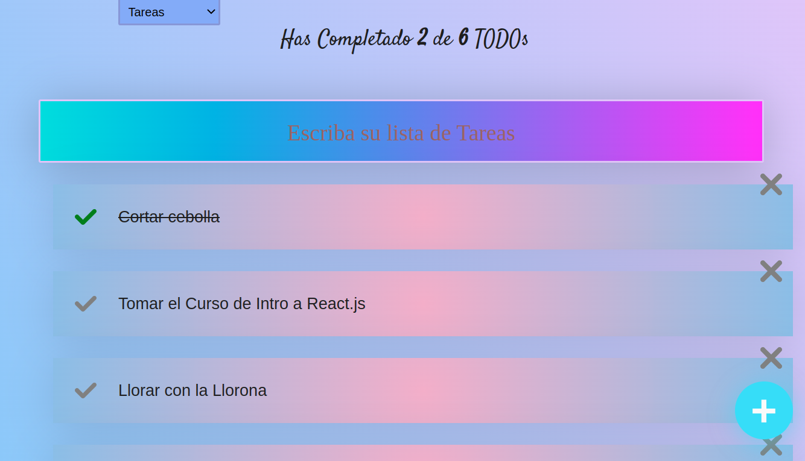

# Repositorio base del Curso de Introducción a React.js

¡Hola que tal!

Este es un ejercicio base del curso de Introduccion a React.js.
En este ejercicio basico de React.js a base a lo que aprendi fua a crear una lista de tareas como agregar, elimninar, tachar como listas y buscar esas tareas aprendi mucho sobre como poder crear algo como esto una Lista de Tareas.

